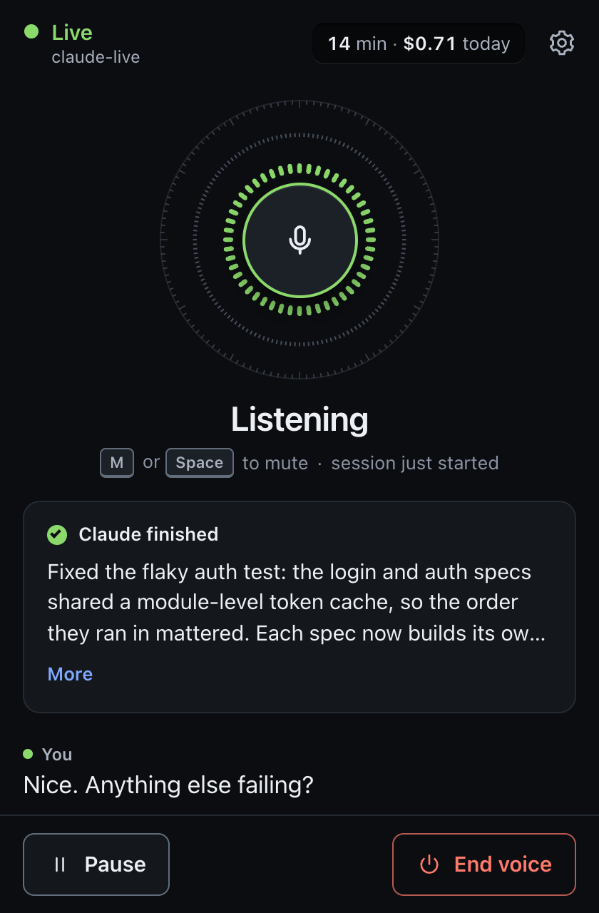

# Sotto

Talk to your running Claude Code session out loud, hands-free, in both directions at once.

<p align="center"></p>

Sotto is a Claude Code plugin. `/talk` opens a small voice window. The voice in that window is OpenAI's `gpt-live-1` (the Live API, not the older Realtime API). It handles the conversation itself: it listens, backchannels, lets you interrupt, and answers small talk. When you ask for something that needs the code, it hands the request to your Claude Code session as if you had typed it. When Claude finishes, the voice tells you the result in its own words. Claude keeps working in the terminal the whole time, and you can keep typing there too.

```
you (speaking) ──▶ gpt-live-1 ──delegates──▶ your Claude Code session ──result──▶ gpt-live-1 ──▶ you (hearing)
```

- **Full duplex.** Interrupt the voice at any time. Interrupting it does not cancel Claude's work; press Esc in the terminal for that.
- **Zero cost when off.** The plugin's hooks fire in every session, but they exit in about 5 ms without reading their input unless this session owns voice. You see no notices and no errors.
- **No model turn to toggle.** `/talk` is handled by a hook that stops the prompt, so turning voice on or off costs no tokens.

> Sotto is an independent open-source project. It is not made, endorsed or supported by Anthropic or OpenAI. "Claude" and "Claude Code" are trademarks of Anthropic; "OpenAI" and "GPT" are trademarks of OpenAI.

## Requirements

- **macOS** (tested on macOS 26, Apple silicon). The daemon and page are portable, but the hooks, window handling and desktop app are only tested on macOS.
- **Claude Code 2.1.281 or later** (it needs cross-session messaging and the `MessageDisplay` and `UserPromptExpansion` hooks).
- **Node.js 22.6 or later** on `PATH`. There are no npm dependencies. If your `node` is older (or missing), [Bun](https://bun.sh) 1.1 or later works too: `/talk` uses it automatically, and tells you how to install one if neither is there.
- **A voice window:** the native **Sotto** desktop app (downloaded signed and notarized on first use; no Xcode needed), or Google Chrome. Chrome is recommended either way as the fallback: its echo cancellation lets you use laptop speakers without the voice hearing itself. With neither, the page opens in your default browser.
- **An OpenAI API key with access to `gpt-live-1`.** Voice is billed by OpenAI to that key (see [Cost](#cost)).

## Install

### From the marketplace

```bash
claude plugin marketplace add chadboyda/sotto
claude plugin install sotto@sotto
```

Then start (or `/reload-plugins` in) a Claude Code session and run `/talk`. That's it: on the first run there is no key yet, so the voice window opens at **Add your OpenAI API key to start**.

1. Create a key at [platform.openai.com/api-keys](https://platform.openai.com/api-keys). Its project must be allowed to use `gpt-live-1` (a project with "All" model access is; a restricted project needs `gpt-live-1` enabled), and the account needs billing set up.
2. Paste it into the window and press **Save**. Sotto checks it with OpenAI first (it must be accepted and list `gpt-live-1`) and tells you plainly if it isn't: a wrong or revoked key, a project without `gpt-live-1`, or no network.
3. A good key is saved in your **macOS Keychain** (login keychain, item "Sotto OpenAI API key": service `sotto`, account `openai-api-key`) and voice connects right away.

The window never shows the key again, only "Key ending in abcd". To change or remove it, open the window's settings (the gear) → **OpenAI API key** → **Change** or **Remove**; this works in Chrome and in the desktop app. `/talk key` tells you which key is in use and where it comes from. Never paste a key into the Claude Code prompt: `/talk key sk-...` does not read it (it opens the window instead), and whatever you type there stays in your prompt history.

**Other ways to provide the key.** The daemon uses the first key it finds, in this order:

| Where | How |
|---|---|
| 1. The environment | `export OPENAI_API_KEY=sk-...` before starting Claude Code |
| 2. A `.env` file | `OPENAI_API_KEY=sk-...` in `<plugin dir>/.env`, `<plugin data dir>/.env` or `~/.sotto/.env` (`chmod 600` it) |
| 3. The macOS Keychain | what the voice window saves; or from a terminal: `security add-generic-password -U -s sotto -a openai-api-key -w` (it prompts for the key, so it stays out of your shell history) |
| 4. The plugin settings | the optional `openai_api_key` field Claude Code asks for when you enable the plugin; Claude Code keeps it in its own secure storage. It reaches a voice daemon when one starts. |

The key only ever goes from the daemon to OpenAI: it is never logged, never sent to the voice page (only its last four characters), never put on a command line, and Sotto never writes it to a file.

### From a clone (for development)

```bash
git clone https://github.com/chadboyda/sotto.git ~/dev/sotto
cd ~/dev/sotto
echo 'OPENAI_API_KEY=sk-...' > .env && chmod 600 .env    # .env is git-ignored
ln -s ~/dev/sotto ~/.claude/skills/sotto
```

The symlink loads the plugin in place as `sotto@skills-dir`, so edits to the repo apply on `/reload-plugins` or the next session. Disable it with `claude plugin disable sotto@skills-dir`. To try it for one session without installing anything: `claude --plugin-dir ~/dev/sotto`.


## Usage

| Command | Effect |
|---|---|
| `/talk` | Toggle voice for this session |
| `/talk on` | Turn voice on here (or move it here from another session) |
| `/talk off` | Turn voice off, from any session |
| `/talk status` | State, owner project, minutes and cost today, voice, persona, policy, last error |
| `/talk restart` | Restart the voice daemon on the latest code at the next pause (see "Updates" below) |
| `/talk quiet` / `milestones` / `walkthrough` | Change how much the voice narrates (see below) |
| `/talk voice` | List the 22 voices, with the current one marked |
| `/talk voice <name>` | Change the voice, for example `/talk voice cedar`. If voice is live, it switches right away (see below). The choice is saved and survives restarts. |
| `/talk persona` | List the personas (built-in and your own), with the current one marked |
| `/talk persona <name>` | Change the voice's personality, for example `/talk persona moss`. Switches right away if voice is live, and is saved like the voice (see [Personas](#personas)) |
| `/talk app` | Use the Sotto desktop app: install it now if it is missing (or retry a failed install), open the voice in it, and remember the choice |
| `/talk window <auto\|app\|chrome>` | Where the voice window opens, saved like the voice. `/talk window` alone shows the current choice and whether the app is installed |
| `/talk key` | Which OpenAI API key is in use (its last four characters) and where it comes from; with no key, opens the window to add one |

`/sotto:talk …` is the same command with its full name.

When voice is on:

1. The voice window opens and connects: the Sotto desktop app's floating panel, or a small Chrome window (see [Desktop app](#desktop-app)). The first time, macOS or Chrome asks for the microphone. The voice greets you.
2. Just talk. Chit-chat stays with the voice. Anything about the code ("what's failing in the tests?", "rename that function") goes to Claude as `[sotto voice <code>] …` (the code changes each time voice is turned on, so look-alike messages are not treated as your speech), and the voice says it has passed it on.
3. When Claude finishes, the voice summarizes the answer. Claude's reply is written voice-first: a short spoken summary, then the details, which stay on screen in the terminal.
4. If Claude needs a permission, the voice tells you to approve it in the terminal. It cannot approve anything itself.

In the voice window: **M** (or Space) mutes and unmutes, **Space** resumes after a pause, and there are microphone, speaker and wake-sensitivity pickers plus Pause and End voice buttons. Captions show both sides.

**Sleep and wake.** After a minute with nobody talking (and nothing pending for Claude), the paid Live session closes and the window shows "Sleeping — just start talking". The mic stays open *locally*: a small voice detector in the page listens, nothing is sent and nothing is billed. When you speak again, a new session starts in about 1.2 s with the conversation so far; the words you said before it connected are transcribed and handed to the model, so it answers the whole sentence. When Claude finishes a voice request or needs your approval while voice sleeps, it wakes up to tell you. **M** while sleeping stops listening; the Wake picker sets sensitivity (Off = click or Space to resume).

### Desktop app

On macOS the voice window is a small native app, **Sotto**: a menu-bar icon plus a floating panel that shows the same voice page as the Chrome window. It stays on top on every Space without taking focus from your terminal.

- **How it gets installed.** Claude Code installs a plugin as a plain copy of this git repository, and we don't commit compiled apps to git. So the plugin fetches the app itself, the first time you use it:
  - **The first `/talk` starts the install in the background.** It downloads the signed app for this plugin version from the [GitHub releases](https://github.com/chadboyda/sotto/releases): about 350 KB, universal, signed with a Developer ID and notarized by Apple. That takes a few seconds, and the voice window waits for it (up to 15 s), so the first `/talk` normally opens the app already. If the install takes longer, this `/talk` uses Chrome and the next one opens the app.
  - **Or run `/talk app`.** It installs the app if it is missing (or retries a failed install), opens the voice in it, and saves `window` = `app`.
  - **What gets checked.** The download is installed only if its sha256 matches, it was built from this plugin's `app/` sources, it is code-signed by team 6M6D2W72ZB and Gatekeeper accepts its notarization.
  - **When the plugin builds it instead.** If you edited `app/`, or there is no release for this version, the plugin builds the app locally. That takes 10 to 20 s and needs Xcode or the Command Line Tools (`xcode-select --install`).
  - **Where it goes.** The app lives in the plugin data directory (`app/Sotto.app`) and is replaced when the plugin's `app/` sources change. Every step is logged to `logs/app-build.log`.
  - **If it fails.** `/talk`, `/talk status` and the voice window say "Desktop app couldn't be installed: <reason>", and voice uses Chrome. `SOTTO_APP_DOWNLOAD=0` skips the download and always builds locally.
- **First app launch:** macOS asks "Sotto would like to access the microphone". Click **Allow** once. If you clicked Don't Allow, turn it on in System Settings → Privacy & Security → Microphone → Sotto.
- **Menu-bar icon:** shows off, connecting, paused, sleeping, listening, you speaking, Sotto speaking, Claude working, muted, or a warning. Its menu has Show/Hide Panel, Compact Panel (a small pill with a mute button), Mute, Voice Off, Open Logs, and Quit.
- **Hotkeys, anywhere:** **⌥⌘M** mute or unmute, **⌥⌘T** show or hide the panel. To change them: `defaults write com.chadboyda.sotto HotkeyMute "ctrl+opt+m"` (or `HotkeyShow`), then relaunch the app. Use `ctrl`, `opt`, `shift`, `cmd` plus a letter, digit, `space` or `f1`-`f12`.
- **Hiding the panel does not stop voice** (the icon still shows it). Voice Off in the menu, End voice in the panel, or `/talk off` ends it. When voice goes off the app quits, unless you tick "Stay in Menu Bar When Voice Is Off".
- **AirPods and other headphones:** when the sound goes to headphones, the app records the microphone itself: the MacBook microphone when your default input is the AirPods, so they never switch to their lower-quality headset mode, and other apps' audio is not lowered. Headphones need no echo cancellation. On speakers the app uses macOS's voice processing instead, which cancels the echo but lowers other apps' audio by about 15 dB while the mic is open (with voice wake, for as long as voice is on). With `window` = `auto` (the default) the plugin still uses Chrome when your default input is Bluetooth and the app cannot avoid it (no other microphone, or sound not going to headphones). Override the app's choice with `defaults write com.chadboyda.sotto MicCapture native` (always record natively, no echo cancellation), `webkit` (always voice processing) or `auto`, then relaunch the app.
- **Choose explicitly** with `/talk window <auto|app|chrome>` or `/talk app`, both saved in `prefs.json`. There is also the `window` option in `/config` (`auto`, `app`, `chrome`, `default`), and `SOTTO_BROWSER` beats both.

**Changing the voice.** gpt-live-1 fixes the voice when a session starts, so a change re-creates the Live session: the old one closes, the window connects a new one seeded with the recent conversation, and the new voice says "Switched to cedar." It takes about a second. Three ways to do it:
- type `/talk voice cedar` (no model turn);
- ask out loud ("can you switch to the cedar voice?"): the voice hands that to Claude, which runs `sotto voice cedar`. The plugin's `bin/` is on Claude's Bash `PATH`. Claude Code may ask you once to approve that command; add `Bash(sotto voice:*)` to your allow rules to skip the prompt;
- the Voice picker in the voice window's settings (the gear).

The choice is saved in `prefs.json` in the data directory. It beats the `voice` option in `/config`, which beats the default (`marin`).

**Updates.** When the plugin's code changes on disk (a `git pull` in the plugin directory, or your own edits), the daemon notices within about 30 s and restarts itself at the next quiet moment: while voice sleeps, or after 45 s with nobody talking and nothing pending for Claude. It never restarts mid-sentence or while Claude works on a voice request. The new daemon takes over the same session, the window reconnects (and reloads if the page changed), and if you were mid-conversation the voice says "I just updated myself" and carries on with what you were talking about. Code that does not load is never switched to. `/talk restart` does the same right away (at the next short pause).

To hear a voice before switching, open **Hear the voices** under the picker and click a name. The live session keeps its voice. The first sample of a voice takes about 4 seconds: a tiny separate Live session says "Hi, I'm Cedar. This is how I sound." (a few billed seconds, well under a cent, counted in today's usage). After that the sample is saved in `voice-previews/` in the data directory and plays at once.

Only one session owns voice at a time. `/talk on` in another session moves voice there, and the voice tells you it switched projects. Voice turns itself off when the owning session exits.

### Decisions reach Claude, even ones the voice answered

The voice is a relay for your coding session, not its memory. It is told to hand Claude anything that decides, asks for, corrects or reports something, even in passing: "Sotto is a good name, let's use it", "let me know when that's merged", "that looks like a bug", your answer to a question Claude asked. It must not claim to have noted or scheduled anything itself; it says "I'll pass that to Claude" and does.

As a safety net, whatever you said that the voice did **not** hand over still reaches Claude about 6 s after you stop talking, as one message marked `(said to the voice assistant, not delegated)`, queued behind anything Claude is doing. Claude treats it as information: it acts on decisions and requests in it, answers project questions briefly, and otherwise replies just "Noted." (which the voice keeps to itself). Filler ("okay, cool", "thanks"), requests about the voice itself ("slow down", "say that again") and echoes of the voice are never forwarded, and nothing is sent twice. The `mirror` option picks what is forwarded: `all` (default), `decisions` (only decisions, feedback and requests), or `off`.

When Claude ends a turn with a question or a list of options, or asks one with AskUserQuestion, the voice is told Claude is waiting, so your next words count as the answer and go to Claude.

### Speakers, echo and talking over the voice

You can interrupt the voice at any time, on headphones or speakers: it is a full-duplex conversation, and Sotto never mutes you while the voice talks. On speakers, three things keep the voice from hearing itself:

1. **Echo cancellation** in the browser (Chrome) or in macOS (the desktop app on speakers), which knows exactly what the voice plays on which speaker. This does nearly all the work.
2. **An echo filter** on what reaches Claude: words that are the voice's own speech heard back (matched in time and wording, allowing for how speech recognition spells things), and Sotto's own fixed sentences from another Sotto in the room, are never sent to Claude as yours. When you talk over the voice, only its words are cut; yours go through.
3. **An echo guard**, only when needed. The voice window measures how much of the voice the microphone still hears after echo cancellation. If that stays high (a speaker the echo canceller cannot see, a very loud speaker), a banner says "Echo detected — headphones recommended" and the guard turns on: it lowers the microphone only at moments it holds nothing louder than the echo, and opens instantly when you speak, so you can still talk over the voice and say "mm-hm". The `echo_guard` option: `auto` (default), `on`, `off`.

**Test echo** in the settings (the gear) plays a short sound on the selected speaker and tells you Good, Some echo or Heavy echo. In Chrome it also tries Chrome's stronger echo cancellation mode and keeps whichever works better on that speaker. The first time you use a new speaker, a quiet version runs once by itself while connecting. Headphones need none of this.

### Speaking policies

| Policy | The voice speaks… |
|---|---|
| `quiet` | Only what needs you: answers to what you asked by voice, Claude's questions, approvals, plan reviews, MCP input requests, and errors. |
| `milestones` (default) | All of that, plus a one-sentence "finished" for turns you typed, subagent and background-task completions, and a progress note at most every 30 s in a long turn. |
| `walkthrough` | Also narrates Claude's progress as it works, task checklist ticks, teammates going idle, and failed tool steps. |

What gets said, per event:

| Event | `quiet` | `milestones` | `walkthrough` |
|---|---|---|---|
| Answer to your voice request | spoken | spoken | spoken, longer |
| Claude asks you a question (`AskUserQuestion`): "Claude's asking: which layout? Options: A, B, or C. Answer in the terminal." | spoken | spoken | spoken |
| Plan ready for approval (`ExitPlanMode`) | spoken (title) | spoken (title) | spoken (title and gist) |
| Tool approval (`PermissionRequest`; the later `permission_prompt` notification is not repeated) | spoken | spoken | spoken |
| MCP server needs input (`Elicitation`), a background session needs input, usage limit reset and waiting for Enter | spoken | spoken | spoken |
| Claude Code hit an API error (`StopFailure`) | spoken | spoken | spoken |
| Background work you asked for by voice finished (its task-notification turn) | spoken | spoken | spoken |
| Turn you typed finished | silent note | one sentence | summary |
| Background work from a typed turn finished | silent note | one sentence | two sentences |
| Subagent finished (`SubagentStop`), batched over 3 s | silent note | spoken | spoken |
| Claude is idle and waiting (`idle_prompt`), once per idle period, only if its result wasn't already spoken | silent note | spoken | spoken |
| Intermediate progress | silent note | spoken at most every 30 s once a turn runs 30 s | spoken at most every 15 s |
| Task checklist tick (`TaskCompleted`), teammate idle (`TeammateIdle`) | silent note | silent note (a teammate's task: spoken) | spoken |
| A tool step failed (`PostToolUseFailure`) | silent note | silent note | spoken, at most every 15 s |
| Tool milestones ("reading voice.js") | silent note | silent note | silent note |

Either way, progress notes reach the voice silently, so "how's it going?" gets a real answer. Nothing spoken reads out code, full paths, URLs or secrets.

Spoken updates never cut the voice off mid-answer: they wait until it has finished speaking. Only a question or an approval Claude is blocked on may break in, and only at the end of a sentence. A low-priority update that has waited more than 20 s becomes a silent note instead.

### Personas

The voice has a personality, and you can pick it. A persona changes *how* the voice talks: its tone, humor, energy, pacing, and whether it offers opinions ("honestly, I'd ship it", "that design's a bit busy") or reacts with feeling (a little celebration at green tests, sympathy when the build breaks). It never changes *what* it relays. Every persona still hands your requests and decisions to Claude, only says something is done when Claude's result says so, answers mic checks itself, never reads secrets aloud and keeps replies short. Those rules come after the persona in the voice model's instructions and are marked as taking precedence.

| Persona | Voice | In one line |
|---|---|---|
| `sotto` (default) | marin | Balanced and friendly, with real opinions and a light touch of humor. |
| `june` | coral | Warm, encouraging partner who celebrates progress and keeps you steady. |
| `moss` | cedar | Dry-witted senior engineer: understated, seen-it-all, quietly funny. |
| `tempo` | tempo | High-energy hype buddy: every green test is a small victory. |
| `koan` | sage | Calm zen mentor: slow, unflappable, finds the lesson in the bug. |
| `vic` | ash | Blunt no-nonsense reviewer: straight answers, zero fluff. |
| `pip` | echo | Playful, sarcastic sidekick with a soft spot for the user. |
| `fern` | verse | Curious explorer who narrates the codebase like a field naturalist. |

Switch with `/talk persona <name>`, the **Persona** picker in the voice window's settings, or just ask out loud ("switch to Moss", "can you be more upbeat?"): the voice hands that to Claude, which runs `sotto persona <name>` (add `Bash(sotto persona:*)` to your allow rules to skip the approval prompt). The choice is saved in `prefs.json`. A persona's instructions are fixed for a Live session, so a switch starts a fresh session with the conversation carried over, like a voice change, and the new persona says hello in one line. By default choosing a persona also switches to its suggested voice; turn off **Switch to the persona's own voice** in settings to keep your voice (a voice you pick afterwards always wins).

**Write your own.** Put a Markdown file in `<data dir>/personas/` (for the symlink install: `~/.claude/plugins/data/sotto-skills-dir/personas/`) or, for one project, in `<project>/.claude/sotto-personas/`. The file name is the persona's name for `/talk persona` (lowercase letters, digits, `-` and `_`). Optional frontmatter sets a display name, a one-line description and a voice; the rest is the personality, written to the voice model in the second person:

```markdown
---
name: Captain
description: A calm ship's captain who treats every deploy like a voyage.
voice: stone
---
You are the Captain: calm, weathered and dryly nautical.
- Good news: "Fair winds. All tests pass." Bad news: "Rough seas: the build failed in the router."
- Hold opinions and say them plainly: "I'd not sail with that migration untested."
- One nautical turn of phrase per reply at most, then the facts. Slow, steady pacing.
```

Keep it short: tone, humor, what you have opinions about, how you react to good and bad news, pacing, a catchphrase or two to use sparingly. Around 150 to 250 words works well; anything past 2,000 characters is cut. Don't restate the relay rules; they are already there and they win. A project file beats a user file with the same name, and either one replaces a built-in of that name. Edits apply from the next voice session; the settings picker reloads the list each time it opens.

### Names the voice should recognize (vocabulary)

Speech recognition mangles unusual names: "impeccable" becomes "in peccable", "TinyFish" becomes "tiny fish". So when a Live session starts, the daemon builds a glossary of names you are likely to say and puts it in the voice model's instructions (about 1,500 tokens at most, collected in the background when you run `/talk on`). The sources, highest priority first:

1. your glossary file, `<data dir>/vocabulary.txt` (for the symlink install: `~/.claude/plugins/data/sotto-skills-dir/vocabulary.txt`);
2. a per-project glossary, `<project>/.claude/sotto-vocabulary.txt`;
3. the project name, the git branch (unless it is main or master), the project's own skills and its top-level folders;
4. your skills in `~/.claude/skills`, then the skills, commands and names of your enabled plugins.

Both glossary files take one term per line, with an optional hint after a colon and a space. Lines starting with `#` are comments:

```text
# ~/.claude/plugins/data/sotto-skills-dir/vocabulary.txt
TinyFish: web automation service
Kubrick: our render farm
impeccable
```

The voice model is told to use these exact spellings. When the daemon hands a request to Claude, it also matches what you said against the full glossary (edit distance plus a rough sound-alike check, tuned to stay quiet on ordinary speech). A likely mishearing adds one note under your words, such as `(Possible names, …: 'in peccable' may be impeccable (skill).)`, and your words themselves are never changed. Claude is told that names get misheard, so it maps sound-alikes to skills, plugins and projects it knows and says which name it took. Edits to the glossary apply from the next voice session. `SOTTO_VOCAB=0` in the environment turns the glossary off. The daemon log records a `vocabulary` line with the term counts and timing.

## Configuration

Set these in `/config` (the sotto rows). An unset or invalid value uses the default.

| Option | Default | Meaning |
|---|---|---|
| `voice` | `marin` | gpt-live-1 voice (alloy, ash, ballad, cedar, coral, marin, sage, verse and more). It applies from the next voice session. A voice chosen with `/talk voice <name>` overrides it. |
| `port` | `47821` | Loopback port for the daemon and the voice window |
| `idle_seconds` | `60` | Sleep (close the paid Live session, keep listening locally) after this many seconds with no speech and no pending request. 0 = never. |
| `wake_sensitivity` | `medium` | How readily your voice wakes a sleeping session: off, low, medium, high. Off = press Space or Wake now. |
| `idle_minutes` | `5` | Legacy; used only when `idle_seconds` is not set. |
| `speaking_policy` | `milestones` | Default narration level |
| `daily_cap_minutes` | `120` | Voice minutes allowed per local day. You get a spoken warning at 80 %; at 100 % voice pauses. 0 = no cap. |
| `mirror` | `all` | What you said to the voice that it did not hand to Claude still reaches Claude as background ([details](#decisions-reach-claude-even-ones-the-voice-answered)): `all`, `decisions`, or `off` |
| `echo_guard` | `auto` | Keeps the voice from hearing itself on speakers ([details](#speakers-echo-and-talking-over-the-voice)): `auto` (only when the window measures echo that echo cancellation left), `on`, or `off` |
| `window` | `auto` | Where the voice window opens: `auto` (the Sotto app on macOS once built, unless your default input is a Bluetooth headset; else Chrome), `app`, `chrome`, or `default` (your default browser) |
| `openai_api_key` | none | Optional, sensitive (asked for when you enable the plugin, not shown in `/config`). The last place the key is looked for; see [Install](#install). |

Environment overrides, for debugging and tests:

| Variable | Effect |
|---|---|
| `SOTTO_BROWSER=auto\|app\|chrome\|default\|none` | How the voice window opens; overrides `window` (`none`: never) |
| `SOTTO_NO_BROWSER=1` | Same as `SOTTO_BROWSER=none` |
| `SOTTO_DEBUG=1` | Log full hook bodies and every non-audio Live event |
| `SOTTO_MIRROR=all\|decisions\|off` | Overrides the `mirror` option |
| `SOTTO_ECHO_GUARD=auto\|on\|off` | Overrides the `echo_guard` option |
| `SOTTO_OPENAI_BASE` | Replace `https://api.openai.com/v1` (tests) |
| `SOTTO_SIGN_IDENTITY` | Sign the desktop app with this identity instead of ad hoc |
| `SOTTO_APP_DOWNLOAD` | `0`: never download the signed desktop app; build it locally |
| `SOTTO_VOCAB=0` | Leave the vocabulary glossary out of the voice instructions and delegated prompts |
| `SOTTO_WAKE_TRANSCRIBE_MODEL` | Model for the wake clip (default `gpt-transcribe`, fallback `gpt-4o-mini-transcribe`) |
| `SOTTO_KEYCHAIN=0` | Do not use the macOS Keychain for the API key |
| `SOTTO_KEYCHAIN_SERVICE` | Keychain service name for the key (default `sotto`; tests use a temporary one) |

## Cost

`gpt-live-1` bills **$0.05 per minute** of connected session (about $3 per hour). The meter runs while the window is connected, even when you're silent or muted. Every session you start is billed at least 15 s. To keep the bill down:

- idle sleep (default 60 s) closes the Live session when nobody has spoken and wakes it when you talk again, so a typical hands-free hour is billed only for the minutes of actual conversation (plus 15 s per wake);
- the daily cap (default 120 minutes, about $6) pauses voice for the rest of the day;
- `/talk status` and the voice window show minutes and dollars used today.

## Privacy

- **Audio goes to OpenAI.** While a Live session is connected, your microphone audio streams to OpenAI's `gpt-live-1` over WebRTC, together with the context the voice needs: the project name and git branch, a glossary of skill and project names, recent conversation, and short summaries of Claude's replies and progress. Sessions are created with `store: false`. When voice wakes from sleep, the short clip you spoke before the session connected is sent to OpenAI's transcription API. OpenAI's API data policies apply.
- **Nothing else leaves your machine.** The daemon listens on `127.0.0.1` only, the voice page makes no requests except to the daemon, and there is no telemetry. While voice sleeps, the wake detector runs locally in the page and sends nothing.
- **What Claude sees:** your transcribed requests arrive in your Claude Code session as messages, so they are handled like anything you type, under Claude Code's own data policies. With the `mirror` option on (the default), so does the rest of what you say to the voice, except filler and requests about the voice itself; set `mirror` to `off` to keep that between you and the voice.
- Logs, state and the optional glossary stay in the plugin data directory. Secrets (the API key, session tokens) are never logged.

## Architecture

```
┌──────────────────── Claude Code session (the "owner") ───────────────────────┐
│ /talk ──▶ UserPromptExpansion hook ──▶ scripts/toggle.sh                     │
│           (stops the prompt: 0 model turns)   │ spawns (nohup, detached)     │
│                                               │ and POSTs /control           │
│ hooks: UserPromptSubmit · PreToolUse · PermissionRequest · MessageDisplay ·  │
│        Stop · StopFailure · SessionEnd ──▶ scripts/hook.sh                   │
│        (bash gate: exits at once unless this session owns voice;             │
│         owner: background curl POST /hook/<event>, never waits)              │
│                                                                              │
│ inbox socket ($CLAUDE_CODE_MESSAGING_SOCKET) ◀── "[sotto voice] …"           │
└──────────────────────────────────▲─────────────────────────┬─────────────────┘
                                   │ auth token + user msg   │ HTTP 127.0.0.1:47821
                                   │                         ▼
            ┌──────────────────── sotto daemon (Node 22, no deps) ────────────────┐
            │ owner binding · delegation state machine · speaking policy          │
            │ SDP proxy: POST /v1/live/sessions  (holds OPENAI_API_KEY)           │
            │ sideband:  wss://…/v1/live/sessions/{id}/attach                     │
            │   ◀─ transcripts, session.delegation.created                         │
            │   ─▶ thinking / commentary / instructions .append                    │
            └──────────▲────────────────────────────────────────────▲─────────────┘
                       │ SSE + /api/* (loopback, page token)         │ sideband (TLS)
            ┌──────────┴──────────────┐                    ┌─────────┴───────────┐
            │ Sotto app / Chrome      │◀──── WebRTC ──────▶│ OpenAI gpt-live-1   │
            │ mic (AEC/NS/AGC), audio │     Opus / UDP     │ delegation: client  │
            │ captions, mute, devices │                    └─────────────────────┘
            └─────────────────────────┘
```

A spoken request travels like this:

1. `gpt-live-1` decides the request needs the backend and emits `session.delegation.created`.
2. The daemon waits for the last words to settle, builds `[sotto voice <code>] <what you said>`, and writes it to the owner session's inbox socket, authenticated with that session's own messaging token.
3. Claude Code runs a turn. The `UserPromptSubmit` hook adds a note telling Claude the message is your speech and asking for a voice-first reply.
4. The `Stop` hook forwards `last_assistant_message`. The daemon makes it speakable (no code, paths shortened to file names, ids and URLs described) and sends it as `session.commentary.append` tied to the delegation. The model then says it.

Stale results, where you asked something newer meanwhile, go to the model as silent background notes instead of being spoken over you. Tool milestones, typed turns, questions, approvals, notifications and subagent or background-task completions are routed by the speaking policy (table above), and every spoken update waits its turn in a priority queue so it never talks over the voice.

State lives in the plugin data directory: `${CLAUDE_PLUGIN_DATA}`, which is `~/.claude/plugins/data/sotto-skills-dir` for the symlink install. If that is unset, it is `~/.sotto`. It holds your optional `vocabulary.txt`, `daemon.pid`, `daemon.key`, `active` (present only while a session owns voice; the hooks' gate), `status.json`, `usage.json`, `prefs.json` (the voice and window you chose with `/talk voice` and `/talk window`), `logs/`, `chrome/` (the voice window's own Chrome profile) and `app/` (the built desktop app).

Design and contracts: [docs/SPEC.md](docs/SPEC.md) (binding spec), [docs/ARCHITECTURE.md](docs/ARCHITECTURE.md) (rationale), [docs/SPEC-DEVIATIONS.md](docs/SPEC-DEVIATIONS.md).

## Troubleshooting

**Start with `/talk status`.** It shows the state and the last error. Logs are in the data directory: `logs/daemon.log` (JSONL), `logs/toggle.log` and `logs/crash.log`.

| Symptom | Fix |
|---|---|
| The voice says "That request hasn't reached Claude Code…" and nothing happens in the terminal | The inbox message is being **held**. The daemon authenticates with the owner session's own messaging token, so Claude Code treats voice messages as the session's own ("own-child"). That delivers them even in `bypassPermissions` sessions: verified with CLI 2.1.281, including a daemon started by another session. An explicit `crossSessionInbound` value (`hold` or `refuse`) overrides the own-child rule, though. Fix: approve the held message in the terminal, or set `"crossSessionInbound": "accept"` (in `/config` → "Messages from your other sessions", or in settings.json). For `claude -p` workers, pass it with `--settings`. |
| `/talk` just makes Claude reply "needs the sotto plugin hooks" | The hooks aren't loaded. Check `/hooks`, run `/reload-plugins`, and check that the symlink points at the repo. |
| "no OpenAI API key yet" / the window asks for a key | Paste a key there (see [Install](#install)), or run `/talk key` to reopen that window. Without the macOS Keychain (`ERROR OPENAI_API_KEY was not found`), export `OPENAI_API_KEY` or put it in `<plugin dir>/.env`. |
| Saving the key fails | The message says why: "OpenAI rejected this key" (mistyped, revoked, or from another org), "its project cannot use gpt-live-1" (enable the model for the key's project, or use another key), "Could not reach OpenAI" (network), or a Keychain error (unlock the login keychain). |
| A new key in the plugin settings is ignored | Keys from the environment, a `.env` file or the Keychain come first (`/talk key` shows which one is used). A daemon picks up the plugin-settings key when it starts; one that has no key at all is restarted by `/talk on`. |
| `ERROR port 47821 is used by another program` | Choose another `port` in `/config`, or stop the program named in brackets (for example an older voice daemon still running). |
| `ERROR node on PATH is vXX; sotto needs Node 22 or newer` | The daemon runs whatever `node` is first on `PATH` (it starts from the plugin directory, so a project's `.node-version` does not apply), or Bun 1.1+ when that Node is too old. Install Node 22 (`brew install node`, `nvm install 22`) or Bun (bun.sh), change your default Node, or set `SOTTO_NODE` to a Node 22 (or Bun) binary before starting Claude Code. |
| `ERROR the voice daemon did not start` | Run `node --version` (it must be 22.6 or later), then read `logs/daemon.log` and `logs/crash.log`. |
| The window says "This window is not connected" | That page wasn't opened by the daemon, so it has no page credentials. Close it and run `/talk on`. |
| The window says "Allow the microphone" | Allow it in the voice window (it uses its own Chrome profile, so it asks once), or check System Settings → Privacy → Microphone → Google Chrome (or → Sotto for the desktop app). |
| The desktop app never opens (always Chrome) | Run `/talk app`: it installs the app (or tells you why it can't) and opens it. `/talk status` names a missing, installing or failed app; `logs/app-build.log` has every install step, and `app/install.json` has the last outcome; the daemon log has a `window.choose` line with the reason (`app_missing` while it builds, `app_failed` with the error in `app/build.json` and `logs/app-build.log`, `bluetooth_input` with a Bluetooth default input the app cannot avoid; `native_mic` means the app was chosen because it records the built-in mic itself). Run `bash scripts/build-app.sh` in the plugin directory to build it by hand. |
| The Sotto panel is gone but the icon is still there | Press ⌥⌘T or use Show Panel in the icon's menu; the panel hides rather than closes. |
| The voice hears itself or cuts out | Use headphones, or Chrome / the desktop app (not the default-browser fallback). Run **Test echo** in the settings: "Heavy echo" means the microphone hears the speaker despite echo cancellation (turn the speaker down or use headphones; the echo guard is on meanwhile). The daemon log has `echo.leak` lines (the measured echo, in dB) and `echo.guard` when the guard turns on or off. With AirPods, keep the built-in mic selected; the picker does this by default, so AirPods stay in high-quality output mode. |
| OpenAI 401 / 429 in status | The key is invalid or lacks `gpt-live-1` access, or you hit the rate limit. If the key came from the voice window or the plugin settings, the window asks for a new one; a key from the environment or a `.env` file has to be changed there. |
| Voice paused on its own | "Sleeping" is the idle sleep (`idle_seconds`): just talk, or press Space. "Paused" is the daily cap, a manual pause, or idle sleep with wake off. Press Space in the window, or run `/talk on`. |
| Voice wakes on its own (TV, music) | Lower the Wake picker to Low, or press M while sleeping. Repeated false wakes back off automatically (up to 2 minutes). |
| Something stuck | Run `/talk off`. As a last resort, `kill $(cat ~/.claude/plugins/data/sotto-skills-dir/daemon.pid)`; the next `/talk on` starts a fresh daemon. |

## Development and testing

```bash
npm test               # unit tests (node:test, ~15 s, no network): scripts, daemon, web
npm run validate       # claude plugin validate . --strict
npm run e2e            # REAL end-to-end tests against gpt-live-1: smoke, sleep + wake, self-update, first-run key setup, decisions (about $0.14)
npm run e2e:restart    # just the self-update e2e (two short sessions, about $0.025); SOTTO_NODE=bun runs it under Bun
npm run e2e:key        # first-run key setup: key card, wrong key, real key saved in a TEMPORARY Keychain item, connects (~15 billed s)
npm run e2e:decisions  # just the decisions e2e: a spoken decision and a casual request must reach Claude (~40 s, about $0.035)
npm run e2e:fixture    # regenerate test/fixtures/ask-files.wav with OpenAI TTS
npm run build:app      # build the desktop app into ${CLAUDE_PLUGIN_DATA:-~/.sotto}/app (incremental)
npm run test:app       # app build smoke + launch tests (temp daemon, mock mic); SOTTO_APP_LIVE=1 adds a real gpt-live-1 session
npm run hooks:install  # use .githooks/pre-commit (tests + validate + secret scan)
npm run release:app -- 0.2.0 [--upload]  # maintainers: universal Developer ID build, notarize, staple, zip + sha256 into dist/
```

**Releasing the desktop app** (maintainers): bump the version in `package.json`, `.claude-plugin/plugin.json`, `app/Info.plist` and `daemon/config.js` together (a unit test checks they agree), commit, then run `npm run release:app -- <version>`. It needs the Developer ID Application certificate in the login keychain and a notarytool profile named `sotto` (`xcrun notarytool store-credentials sotto --apple-id ... --team-id 6M6D2W72ZB`). It submits the build to Apple and waits (a minute or so), staples the ticket, and leaves `dist/Sotto.zip`, `dist/Sotto.zip.sha256` and `dist/release.json`. Push the tag `v<version>`, then rerun with `--upload` (or `gh release create v<version> dist/Sotto.zip dist/Sotto.zip.sha256`). The release must be built from the tagged commit: the plugin only installs a release whose `app/` sources hash equals its own.

`npm run e2e` runs the real product with a stand-in for Claude:

- **Start:** it runs `scripts/toggle.sh on` the way the UserPromptExpansion hook does. This cold-starts a detached daemon bound to a fake inbox socket.
- **Speak:** it launches headless Chrome (throwaway profile) at the voice page. The fake mic plays a recorded question, "Hey, can you ask Claude what files are in this project?"
- **Check the request:** it asserts that the WebRTC session is created with `gpt-live-1`, the sideband attaches, the input transcript arrives, and exactly one inbox write goes out (the auth line plus your utterance).
- **Answer:** it runs the real `scripts/hook.sh Stop` with a canned answer. It then asserts that `session.commentary.appended` arrives and the model speaks the answer.
- **Switch voice:** it runs `toggle.sh` with `voice cedar` and asserts that a replacement session is created in `cedar` (reason `reconnect`), the old one closes with `close_requested`, the new voice says "Switched…", and `prefs.json` holds the choice. Measured: about 0.7 s to live again and about 2 s to the spoken confirmation.
- **Stop:** it runs `toggle.sh off` and asserts `session.closed` (`close_requested`) and that the daemon exits.

A 90 s budget guard keeps Live time bounded. Timings are printed at the end. Recent runs measured about 0.6 s from the delegation to the inbox write (about 1.1 s from the end of speech on the audio clock), and 0.65 to 0.95 s from the Stop hook to the start of the spoken answer.

Try the plugin without installing it: `claude --plugin-dir ~/dev/sotto`. The command below is a headless toggle probe that makes no model call:

```bash
SOTTO_NO_BROWSER=1 claude -p --plugin-dir . --output-format json "/talk status"
# → "result":"Operation stopped by hook: sotto: voice is off.", "num_turns":0
```

Contributor conventions are in [.claude/CLAUDE.md](.claude/CLAUDE.md). It lives under `.claude/` because `plugin validate --strict` rejects a `CLAUDE.md` at the plugin root, and Claude Code still loads it as project memory from there.

## Contributing

See [CONTRIBUTING.md](CONTRIBUTING.md).

## License and disclaimer

[MIT](LICENSE). Copyright (c) 2026 Chad Boyda.

Sotto is provided as is, without warranty. It sends your microphone audio to a paid third-party API billed to your own key and lets you drive a coding agent by voice, where transcription errors happen; review what Claude does as you would for typed requests. Sotto is not affiliated with Anthropic or OpenAI.
